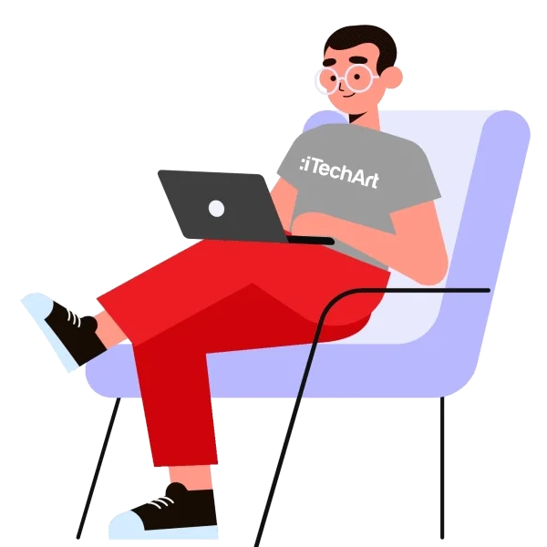
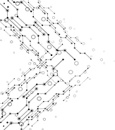
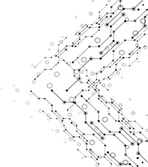

<h2 align="left">Hi 👋! My name is Anand Choudhary and I'm a Web Developer, from India</h2>

###

### Profile Views

  

### Skills

  
  
  
  
  
  
  
  
  
  
  
  

### Social Media 

  
  
  

 

### Statics

  
  

### Streak

  

   
   
   
  

 

