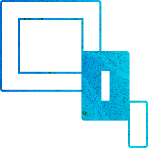

> <h1>Building blocks </h1>
<table>
  <tr>
  <th></th>
 <th><h1>Modern $ Responsive</h1></th>
 <th></th>
 <th><h1>Fast Performance</h1></th>
</tr>
<tr>
    <th></th>
     <th><h1>Clean Code</h1></th>
     <th></th>
     <th><h1>Great Seo</h1></th>
</tr>
</table>
