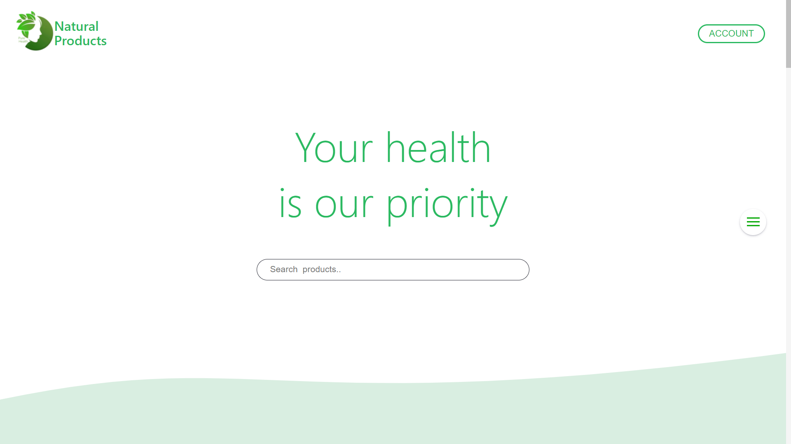
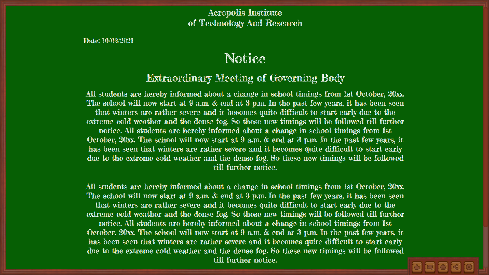
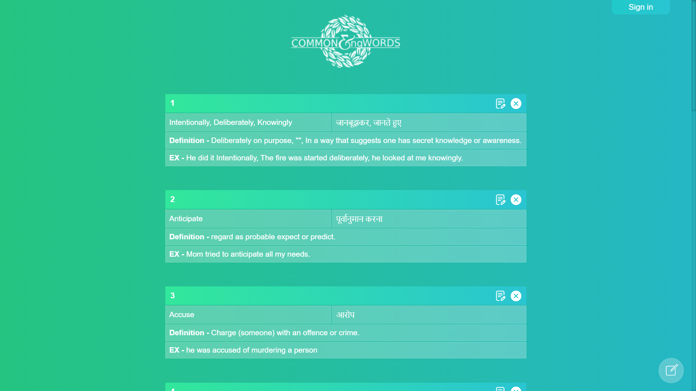

<h1 align="left">Hi 👋! I'm a Web Developer</h1>

<picture>
  <source media="(max-width:600px)" srcset="#">
  
</picture>

### Profile Views

  

### Skills

  
  
  
  
  <!-- 
   -->
  
  
  
  
  
  
  

### Social Media 

 
 

 

### Statics

  
  

### Streak
 

  

   
  

 

### Projects

 
<table>
   <tr><!--Here-->
       <th valign="center" width="33%" colspan="3">
           

               Top Projects
            

        </th>
    </tr>
    <tr>
        <th valign="center" width="33%">
            

                
            

        </th>
        <th valign="center" width="33%">
            

                
            

        </th>
        <th valign="center" width="33%">
            

                
            

        </th>
    </tr>
    <tr>
        <td valign="top" width="33%">
            

                <a href="https://pure-health-natural-products.000webhostapp.com/index.php" target="_blank">
                    <b>PureHealth Ecommerce </b>
                </a>
                 
                <a href="https://github.com/Its-anand/Pure-Health" target="_blank">
                    View Repo
                </a>
            

        </td>
        <td valign="top" width="33%">
            

                <a href="https://acroboard.000webhostapp.com/" target="_blank">
                    <b>Acroplis Notice Board</b>
                </a>
                 
                <a href="https://github.com/Its-anand/Acropolis-Notice-Board" target="_blank">
                    View Repo
                </a>
            

        </td>
        <td valign="top" width="33%">
            

                <a href="https://minglish.000webhostapp.com/" target="_blank">
                    <b>Common Meaningful words Website</b>
                </a>
                 
                <a href="https://github.com/Its-anand/CMW-project" target="_blank">
                    View Repo
                </a>
            

        </td>
    </tr>
</table>
 

 
<table>
   <tr><!--Here-->
       <th valign="center" width="33%" colspan="3">
           

               Css Only Arts
            

        </th>
    </tr>
    <tr>
        <th valign="center" width="33%">
            

                
            

        </th>
        <th valign="center" width="33%">
            

                
            

        </th>
        <th valign="center" width="33%">
            

                
            

        </th>
    </tr>
    <tr>
        <td valign="top" width="33%">
            

                <a href="https://its-anand.github.io/Sunset-at-the-beach-image-made-with-html-and-css-only/" target="_blank">
                    <b>Sunset On The Beach</b>
                </a>
                 
                <a href="https://github.com/Its-anand/Sunset-on-the-beach-image-made-with-html-and-css-only" target="_blank">
                    View Repo
                </a>
            

        </td>
        <td valign="top" width="33%">
            

                <a href="https://its-anand.github.io/Diwali-Special-diya-and-moving-bati-with-html-css-only/" target="_blank">
                    <b>Dewali Diya Animation</b>
                </a>
                 
                <a href="https://github.com/Its-anand/Diwali-Special-diya-and-moving-bati-with-html-css-only" target="_blank">
                    View Repo
                </a>
            

        </td>
        <td valign="top" width="33%">
            

                <a href="https://its-anand.github.io/sunset-road-trip/" target="_blank">
                    <b>Sunset Road Trip</b>
                </a>
                 
                <a href="https://github.com/Its-anand/sunset-road-trip" target="_blank">
                    View Repo
                </a>
            

        </td>
    </tr>
</table>

 

### Trophy

